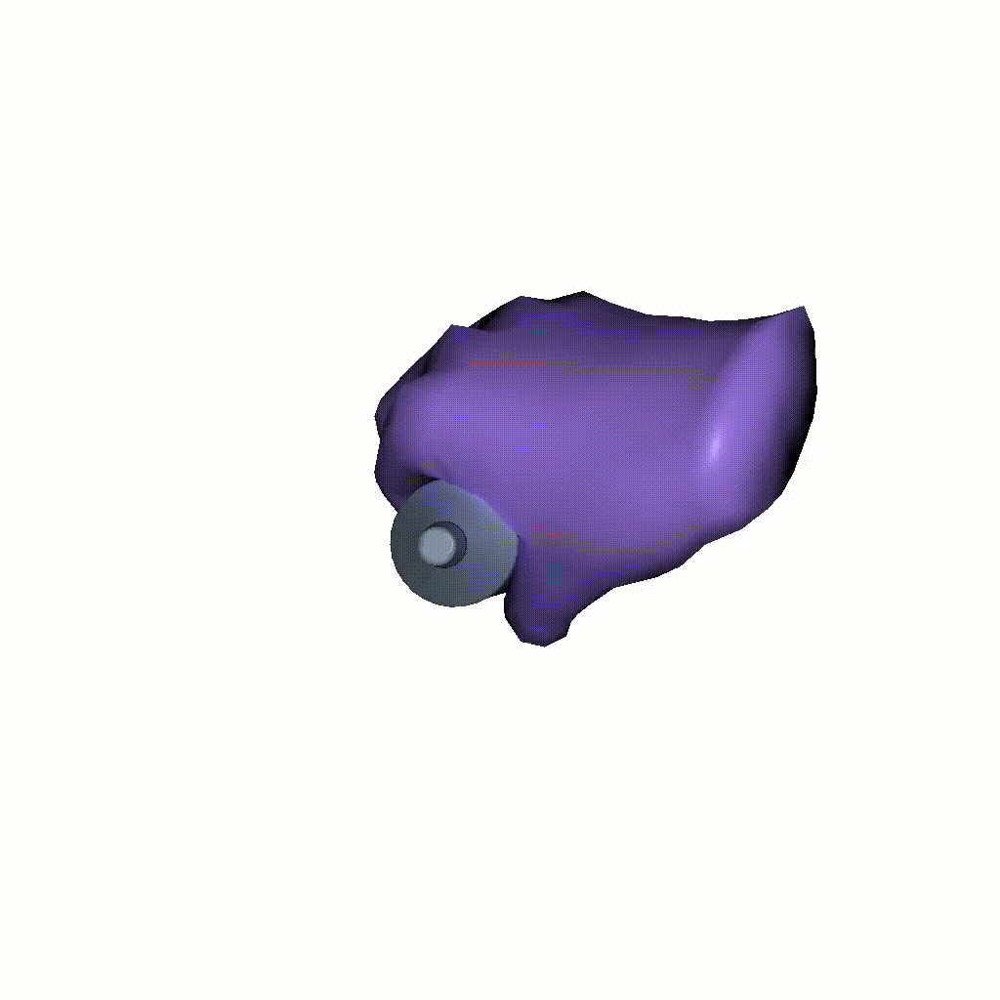
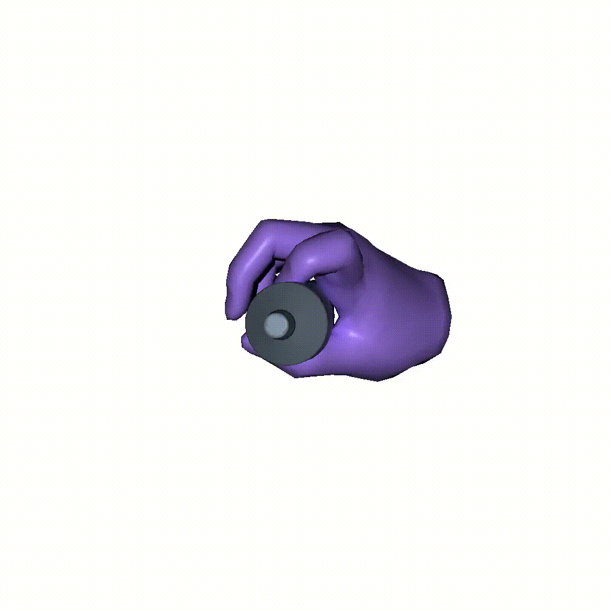
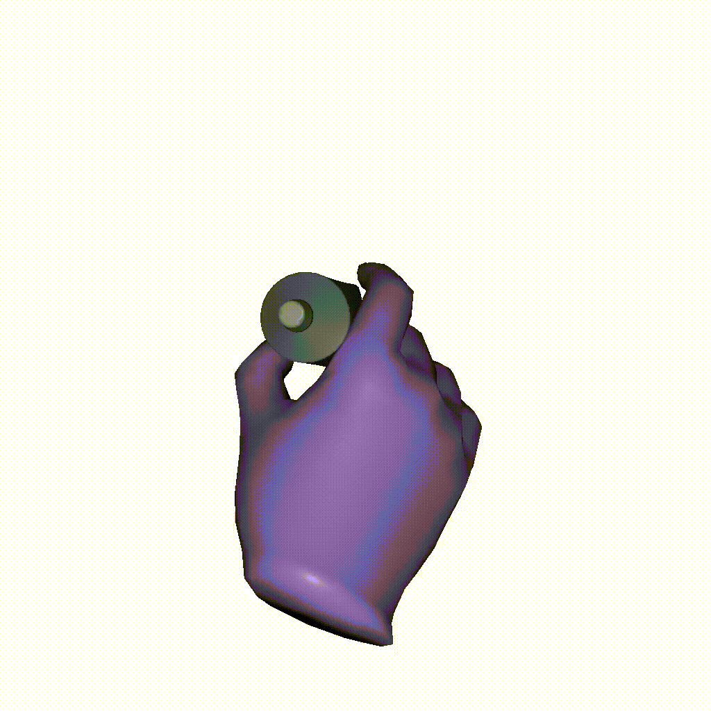
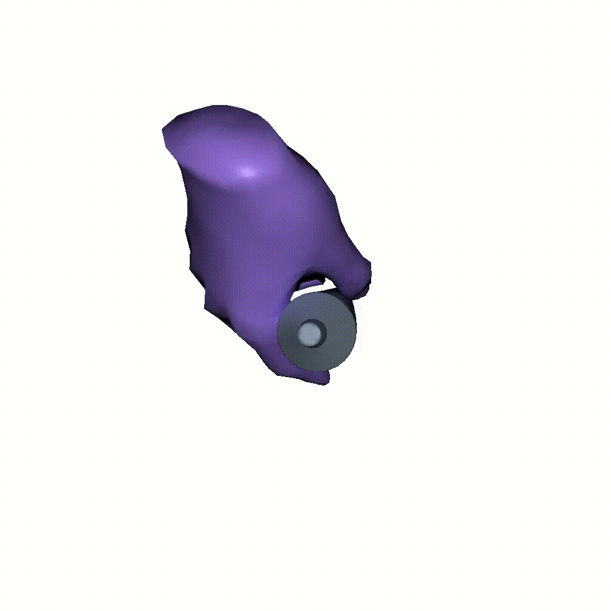

<br />
<p align="center">

  <h1 align="center">ContactGen: Generative Contact Modeling <br>for Grasp Generation</h1>

  <p align="center">
    <a href="https://stevenlsw.github.io"><strong>Shaowei Liu</strong></a>
    ·
    <a href="https://yangzhou95.github.io/"><strong>Yang Zhou</strong></a>
    ·
    <a href="https://jimeiyang.github.io/"><strong>Jimei Yang</strong></a>
    ·
    <a href="https://saurabhg.web.illinois.edu/"><strong>Saurabh Gupta*</strong></a>
    ·
    <a href="https://shenlong.web.illinois.edu/"><strong>Shenlong Wang*</strong></a>
    ·
  </p>

 <p align="center">
    
  </p>

  <p align="center">
    <a href='https://arxiv.org/abs/2310.03740'>
      
    </a>
    <a href='https://stevenlsw.github.io/contactgen/' style='padding-left: 0.5rem;'>
      
    <a href='https://youtu.be/pBgaQdMdB3Q' style='padding-left: 0.5rem;'>
      
    </a>
  </p>
</p>
<br />

This repository contains the pytorch implementation for the paper [ContactGen: Generative Contact Modeling for Grasp Generation](), ICCV 2023. In this paper, we present a novel object-centric contact representation for high-fidelity and diverse human grasp synthesis of 3D objects.<br><br>

## Installation
- Clone this repository: 
    ```Shell
    git clone https://github.com/stevenlsw/contactgen.git
    cd contactgen
    ```
- Install requirements by the following commands:
    ```Shell
    conda create -n contactgen python=3.9
    conda activate contactgen
    pip3 install torch # install compatible version
    pip install "git+https://github.com/facebookresearch/pytorch3d.git"
    pip install -r requirements.txt
    cd pointnet_lib && python setup.py install
    ```

## Demo

- Generate grasp for toothpaste from sampled ContactGen. results are stored in `save_root`.

  ```Shell
  python demo.py --obj_path assets/toothpaste.ply --n_samples=10 --save_root exp/demo_results
  ```

- Below shows some generated samples for toothpaste:

  | 1 | 2 | 3 | 4|
  | :---: | :---: |:---: | :---: |
  | ||||

- Visualize the generated grasps in `meshlab` or by the following command using `open3d`.

  ```Shell
  python vis_grasp.py --hand_path exp/demo_results/grasp_0.obj --obj_path assets/toothpaste.ply
  ```

## Training & Inference

- Download the processed GRAB dataset from [here](https://drive.google.com/file/d/1m85aiTGHpqqgQuF9NeQNE7VEEJ8V_aJ_/view?usp=share_link) and **unzip** to current directory. 

- Train the model by the following command, experiment logs are stored in `work_dir`.
  ```Shell
  python train.py --work_dir exp
  ```

- Inference using the following command, generated samples are stored in `save_root`.
  ```Shell
  python eval.py --save_root exp/results --checkpoint exp/checkpoint.pt
  ```

- Pretrained models can be found at `checkpoint/checkpoint.pt`
 

## Citation

If you find our work useful in your research, please cite:

```BiBTeX
@inproceedings{liu2023contactgen,
  title={ContactGen: Generative Contact Modeling for Grasp Generation},
  author={Liu, Shaowei and Zhou, Yang and Yang, Jimei and Gupta, Saurabh and Wang, Shenlong},
  booktitle={Proceedings of the IEEE/CVF International Conference on Computer Vision},
  year={2023}
}
}
```

## Acknowledges
We thank:
* [Manopth](https://github.com/hassony2/manopth) for ManoLayer implementation
* [GrabNet](https://github.com/otaheri/GrabNet) for training and testing on GRAB dataset
* [ContactOpt](https://github.com/facebookresearch/ContactOpt) for contact map computation
* [HALO](https://github.com/korrawe/halo) for grasp evaluation setup
* [LatentHuman](https://latenthuman.github.io/) for SDF model implementation
