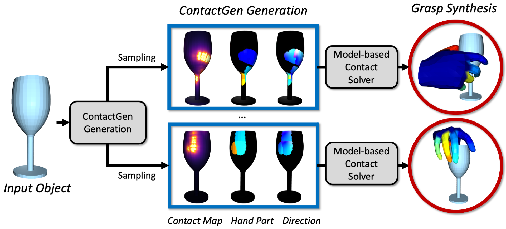

<br />
<p align="center">

  <h1 align="center">ContactGen: Generative Contact Modeling <br>for Grasp Generation</h1>

  <p align="center">
    <a href="https://stevenlsw.github.io"><strong>Shaowei Liu</strong></a>
    ·
    <a href="https://yangzhou95.github.io/"><strong>Yang Zhou</strong></a>
    ·
    <a href="https://jimeiyang.github.io/"><strong>Jimei Yang</strong></a>
    ·
    <a href="https://saurabhg.web.illinois.edu/"><strong>Saurabh Gupta*</strong></a>
    ·
    <a href="https://shenlong.web.illinois.edu/"><strong>Shenlong Wang*</strong></a>
    ·
  </p>

 <p align="center">
    
  </p>

  <p align="center">
    <a href='https://arxiv.org/abs/2310.03740'>
      
    </a>
    <a href='https://stevenlsw.github.io/contactgen/' style='padding-left: 0.5rem;'>
      
    <a href='https://youtu.be/pBgaQdMdB3Q' style='padding-left: 0.5rem;'>
      
    </a>
  </p>
</p>
<br />

This repository contains the pytorch implementation for the paper [ContactGen: Generative Contact Modeling for Grasp Generation](), ICCV 2023. In this paper, we present a novel object-centric contact representation for high-fidelity and diverse human grasp synthesis of arbitrary 3D objects.<br><br>


## Citation

If you find our work useful in your research, please cite:

```BiBTeX
@inproceedings{liu2023contactgen,
  title={ContactGen: Generative Contact Modeling for Grasp Generation},
  author={Liu, Shaowei and Zhou, Yang and Yang, Jimei and Gupta, Saurabh and Wang, Shenlong},
  booktitle={Proceedings of the IEEE/CVF International Conference on Computer Vision},
  year={2023}
}
}
```

